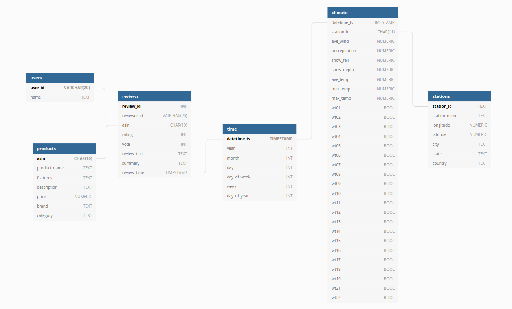
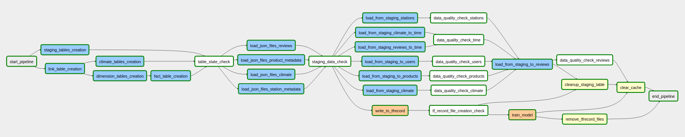
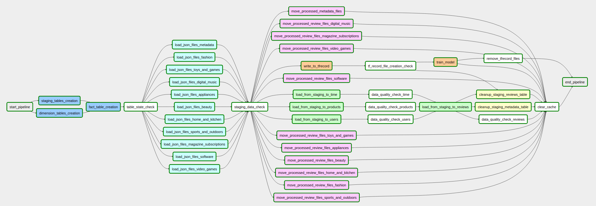

# Amazon Review Data Process Pipelining Project <!-- omit in toc -->

## Table of Contents <!-- omit in toc -->
- [1 Objective](#1-objective)
- [2 Directory structure](#2-directory-structure)
- [3 Dataset](#3-dataset)
  - [3.1 Data sources](#31-data-sources)
  - [3.2 Data format](#32-data-format)
  - [3.3 Data modeling](#33-data-modeling)
- [4 Setup environment](#4-setup-environment)
- [5 Pipeline architecture](#5-pipeline-architecture)
  - [5.1 AWS (Redshift)](#51-aws-redshift)
  - [5.2 Local environment with LocalExecutor](#52-local-environment-with-localexecutor)
  - [5.3 Local environment with CeleryExeutor (Optional)](#53-local-environment-with-celeryexeutor-optional)
  - [5.4 Machine Learning Model](#54-machine-learning-model)
- [6 Performance](#6-performance)
  - [6.1 Data upload](#61-data-upload)
  - [6.2 Scalrability](#62-scalrability)
- [7 Further inmprovements/TODOs](#7-further-inmprovementstodos)
- [References](#references)
- [Links](#links)

---

## 1 Objective
When we have large amount of data which is continuously added,
we need to process it for data analysis and building machine learning models efficiently and effectively
to make pipelining tasks easier and run the workflow faster
otherwise all data cannot be handled and it causes dropping data or needs to skip to run properly.

For this project, focusing on building pipeline for processing streaming like data and
applying batch processing the data by scheduler with high throughput.

In order for that, continuously generate data and store them to data source as raw data to mock streaming data, then, from the data source, apply ETL process and upload them to database.
Additionally, take review texts and ratings data and process them for ML tasks.

To accomplish these tasks, following tools are used:
- *Apache Airflow*
  - Schedule tasks
- *AWS Redshift*
  - Easy distribute data and concurrent query with high load
- *PostgreSQL*
  - Basic
- *Celery*
  - Distribute tasks to multuple machines
- *Tensorflow*
  - Serialize data and train ML model

## 2 Directory structure
This project directory consists of three applications.
The first one is `workflow` which is the app of main *data engineering* part to build data processing pipeline.
The second one is `amzn_review` which is handling original source data
including cleaning data, uploading data to *AWS S3* bucket or local diractory etc.
The third one is `rating_model` which is machine learning model to predict ratings from review texts.

The following is the architecture. In order to make each application can be decouple easily,
they are independently put inside the directory instead of put everything
inside main source directory such as `src/`.

```sh
.
├─ .env                 # dotenv file to set environment variable. this will be parsed by `pipenv`
├─ Pipfile              # dependencies on this project
├─ README.html          # readme file
├─ Makefile             # used for development(under-development)
├─ setup.py             # set up script for the project
├─ data                 # directory containing review data
|    ├─ raw             # store all files which have been processed (may remove later)
|    |    ├─ metadata
|    |    └─ reviews
|    ├─ uploaded        # store all uploaded data and will be processed
|    |    ├─ metadata   # store all product metadata
|    |    └─ reviews    # contains reviews to be processed
|    ├─ category1       # store all reviews belonging to each category
|    ├─ category2       # (for instance, "fashion", "home_and_kitchen", etc.)
|    ├    :             # these files will be used for `uploader`
├─ docs                 # directory containing documents and related items
├─ scripts
├─ settings             # general settings for the applications
|
|  # main projects
├─ amzn_review          # app to handle review data
├─ rating_model         # ML model app for predicting ratings (submodule)
└─ workflow             # airflow app
     ├─ dags            # directory contains all dag
     |    ├─ sql        # SQL queries used for tasks
     ├─ plugins         # setup database and tables on Redshift cluster
     |    └─ operators  # directory containing operators for ETL process
```

## 3 Dataset

### 3.1 Data sources

In this project, following data sources are used:
- Review data
  1. Review
  2. Producs
- Climat data

  3. observing station
  4. daily climate report

Dataset in the first group (Review data) is fetched from
[Amazon Review Data(2018)](https://nijianmo.github.io/amazon/index.html)[1].
To simplify the problem, data from *5-core* are used,
and metadata of the product is generated based on metadata format described in
the section [Data format](#31j-data-format).

In addition to the dataset above,
climate data is used to anylize the weather of the days.
The original data source is climate data from NOAA([link](https://www.ncdc.noaa.gov/cdo-web/)).

In order to use scripts from this project,
follow the structure below:
```
$ export DATA_CATEGORIES=digital_music,home_and_kitchen

# and then directory structure should be like following:

data
├─ metadata
|    ├─ products
|         ├─ 00000000.json.gz
|         ├─ 00000001.json.gz
|              :
├─ digital_music                    # original data directory
|    ├─ 00000000.json.gz
|    ├─ 00000001.json.gz
|         :
├─ home_and_kitchen                 # original data directory
|    ├─ 00000000.json.gz
|    ├─ 00000001.json.gz
|         :
└─ uploaded                         # target directory to process
     ├─ metadata
     |    ├─ climate
     |    |    └─ ghcnd-stations.txt
     |    ├─ products
     |         ├─ 00000000.json.gz  # file name can be anything
     |         ├─ 00000001.json.gz
     |              :
     ├─ climate
     └─ reviews                          # target directory to process
          ├─ digital_music
          |    ├─ 00000000.json.gz
          |    ├─ 00000001.json.gz
          |         :
          ├─ home_and_kitchen
          |    ├─ 00000000.json.gz
          |    ├─ 00000001.json.gz
          |         :
```
Each `.json.gz` file contains one review.
The `metadata` directory containes metadata of products.

Additionally, temparature data is used. The description of data is
[link](https://www1.ncdc.noaa.gov/pub/data/cdo/documentation/GHCND_documentation.pdf).

### 3.2 Data format

#### Review data <!-- omit in toc -->
Followings are sample formats about the reviews and product metadata.
These samples are directly taken from original samples.([Link](https://nijianmo.github.io/amazon/index.html#sample-review))
```json
# sample review 1
{
  "image": ["https://images-na.ssl-images-amazon.com/images/I/71eG75FTJJL._SY88.jpg"], 
  "overall": 5.0, 
  "vote": "2", 
  "verified": true, 
  "reviewTime": "01 1, 2018", 
  "reviewerID": "AUI6WTTT0QZYS", 
  "asin": "5120053084", 
  "style": {
	"Size:": "Large", 
	"Color:": "Charcoal"
  }, 
  "reviewerName": "Abbey", 
  "reviewText": "I now have 4 of the 5 available colors of this shirt... ", 
  "summary": "Comfy, flattering, discreet--highly recommended!", 
  "unixReviewTime": 1514764800
}

# sample review 2
{
  "reviewerID": "A2SUAM1J3GNN3B",
  "asin": "0000013714",
  "reviewerName": "J. McDonald",
  "vote": 5,
  "style": {
    "Format:": "Hardcover"
  },
  "reviewText": "I bought this for my husband who plays the piano.  He is...",
  "overall": 5.0,
  "summary": "Heavenly Highway Hymns",
  "unixReviewTime": 1252800000,
  "reviewTime": "09 13, 2009"
}

# Sample metadata
{
  "asin": "0000031852",
  "title": "Girls Ballet Tutu Zebra Hot Pink",
  "feature": ["Botiquecutie Trademark exclusive Brand",
              "Hot Pink Layered Zebra Print Tutu",
              "Fits girls up to a size 4T",
              "Hand wash / Line Dry",
              "Includes a Botiquecutie TM Exclusive hair flower bow"],
  "description": "This tutu is great for dress up play for your little ballerina. Botiquecute Trade Mark exclusive brand. Hot Pink Zebra print tutu.", 
  "price": 3.17,
  "image": "http://ecx.images-amazon.com/images/I/51fAmVkTbyL._SY300_.jpg",
  "also_buy": ["B00JHONN1S", "B002BZX8Z6", ...],
  "also_viewed": ["B002BZX8Z6", "B00JHONN1S", ...],
  "salesRank": {"Toys & Games": 211836},
  "brand": "Coxlures",
  "categories": [["Sports & Outdoors", "Other Sports", "Dance"]]
}
```

To make the problem simple, metadata is generated randomly based on used `asin`(Amazon Standard Identification Number) and
"related", "also_bought(also_buy)", "also_viewed", "bought_together", "buy_after_viewing" columns are all empty list, instead of requesting the actual data,
since these data will not be used and not affect further procedures and processes.
(*ASIN*'s explanation is [here](https://www.amazon.com/gp/seller/asin-upc-isbn-info.html)(amazon))

#### Climate data <!-- omit in toc -->
As climate data, "stations" and "climate" data is used as mentioned before.

Each group contains as following respectively:
```
stations:
  station_id, longitude, latitude, elevation, name, unused-code1, unused-code2  

climate:
  STATION, NAME, DATE, AWND, PRCP, SNOW, SNWD, TAVG, TMAX, TMIN, WT01-19, WT21-22
  (AWND, PRCP, SHOW, SNWD, TAVG, TMIN, TMAX, WT01-19 and WT21-22 are expalined in the link attached in section 3.1)
```

"stations" data is stored in `.txt` file and "climate"s are in `.csv` files.

### 3.3 Data modeling

The following image shows the final data modeling for this project.



This data model is used in AWS settings[[section5.1](#51-aws-redshift)].
For local environment, "climate" and "stations" tables are omitted to simpliy the problem.

(Note: "users" model has "city", "state", "country", but they are not included in original data source,
so that it is not included in this data modeling diagram.)

This data model is to take product performance or popularity if it can be used for recommendation.
That is, if the product has averagely high ratings, it can be recommended to other users.

Additionally, to see the effect of weather (might be purchased some cooling system in hot days),
climate data is also collected.
They can be join by date (`day_of_year` column).
Technically speaking, addresses of the reviewers are not provided,
so that it can not be used for now, but once the data is started to collect,
this `join` operation can be applied and can use them for further analysis.
(In the actual implementation, `users` table has address related keys such as `city`,
but the data does not contain so all of them will be `null`.
In practice, company should have those information so that it can be used for more precise querying.)


## 4 Setup environment

Following is a list of requirements for this project.
```sh
python>=3.8.5   # this will not work with python 2.x nor <3.8
apache-airflow[postgres,celery]==1.10.12
boto3==1.14.36
cryptography==3.0
faker           # used for fake metadata, this is not required if you have actual metadata
numpy==1.18.5
pipenv==2020.8.13 # old version may not work to parse library version
redis==3.5.3
sentencepiece
tensorflow==2.3.0
tokenizers
tqdm
```

To simplify to execute the scripts and tasks, `pipenv` library is used to manage third-party libraries and this project.

After installed `pipenv`, install the necessary packages.
```sh
$ pip install --user pipenv

$ # once pipenv is installed,
$ # go to the project directory and install applications
$ make

$ # or if run on local environment (this will create one additional database)
$ make local
```

Note that databases are only for temporay usage (using `docker run --rm`)
so that once stop the corresponding containers, all data will be gone.

You have to prepare dataset beforehand. Download data from [link(subset data)](https://nijianmo.github.io/amazon/index.html#subsets)

Then all lines in the gzipped files need to be fetched and written to indvuidual files.
The example code is following:
```python
>>> from amzn_review.helper import load_data
>>> # set target file path to load and define the category
>>> # this is an example to preprocess for "home_and_kitchen" data
>>> # this will store data in `./data/home_and_kitchen`
>>> load_data(filepath='path/to/Home_and_Kitchen_5.json.gz', category='home_and_kitchen')
```

## 5 Pipeline architecture

### 5.1 AWS (Redshift)
Once data size becomes large, data should be distributed.
However, query performance is also the significant part to take into consideration.
For first step, only the fact table and the largest dimension table, *products* will be distributed based on `asin` key.


Before executing tasks, the dataset in bucket must be following architecture:
```
# example: categories are "digital_music" and "home_and_kitchen"
${s3_bucket}
 ├─ metadata                         # store metadata for proessing
 |    ├─ staging_metadata_jsonpath.json
 |    └─ staging_reviews_jsonpath.json
 └─ uploaded                         # target directory to process
      ├─ metadata
      |    ├─ climate
      |    |    └─ ghcnd-stations.txt
      |    ├─ products
      |         ├─ 00000000.json.gz  # file name can be anything
      |         ├─ 00000001.json.gz
      |              :
      ├─ climate                     # target data directory to process
      |    ├─ austin.csv
      |    ├─ nyc.csv
      |    ├─ sf.csv
      |         :
      └─ reviews                     # target data directory to process
           ├─ digital_music
           |    ├─ 00000000.json.gz
           |    ├─ 00000001.json.gz
           |         :
           ├─ home_and_kitchen
           |    ├─ 00000000.json.gz
           |    ├─ 00000001.json.gz
           |         :
```

The review data is distributed by `asin` key, since the target analysis is for investigating each product,
so that the same product information should be stored in the same node.
Since the number of products are huge, which is, the number is much larger than number of Redshift nodes,
the data will be distributed evenly and the skewness in each node will be small.

#### Execution <!-- omit in toc -->
```sh
$ # upload file objects to S3 buckts continuously
$ # (this requires setting up S3 bucket and set as environment variable `AWS_S3_BUCKET` beforehand)
$ make start-uploader
 
$ # create redshift cluster (this may take a while)
$ # this requires set `AWS_REDSHIFT_PASSWORD` as env variable.
$ # other than this, see `.env` file to see what variables can be used
$ pipenv run amzn-review redshift cluster create
Loading .env environment variables...
Waiting for the cluster available...
===================================
  Redshift Cluster Information
-----------------------------------
  ClusterIdentifier: redshift-cluster-1
  NodeType:          dc2.large
  ClusterStatus:     available
  MasterUsername:    appuser
  DBName:            dev
  Endpoint:          {'Address': 'redshift-cluster-1.xxxxxx.us-west-2.redshift.amazonaws.com', 'Port': 5439}
  NumberOfNodes:     2
  VpcId:             vpc-xxxxxxxx
```

Once you get ready, run `airflow` by following command:

```sh
$ # start airflow server
$ make start-worker

$ # terminate airflow server
$ make stop-worker
```

Then, go to *Airflow UI* (localhost:3000 or depending on configuration) and start task `amzn_review_etl_aws`.
(In this *DAG*, ML training step is skipped by entity function)

### 5.2 Local environment with LocalExecutor
Since the data is stored in local environment with *RDBMS*,
data is not distributed, therefore all data is put in one database.
Based on the data modeling shown in previous section,
the data process pipeline becomes following arcitecture.


This is the specs to be used:

- Machine spechs (both are in the same local network)
  1. Airflow master/worker node
      - Ubuntu 18.04
      - Intel Core i5-8250U
      - 500GB 2.5-inch SSD SATA 6.0Gb/s
  2. PostgreSQL
      - Ubuntu 18.04
      - Intel Xeon E5-1620
      - External disk drive
        - 1TB HDD 7200RPM SATA 3.0Gb/s (Disk1)
        - 500GB 2.5-inch SSD SATA 6.0Gb/s (Disk2)
      - Database version (running on containers)
        - PostgreSQL: 12.4
        - Redis: 6.06
- Airflow settings:
  - Local Executor

#### Execution <!-- omit in toc -->
Upload files to target directory to mock streaming data on worker machine
(this is the same machine as the one running Airflow Master Node, because it uses `LocalExecutor`)
```
$ pipenv run amzn-review uploader run --local
```

Time to take to write data with the uploader to local directory for 10K data is 15-25 minutes,
so that roughly 400 - 670 files/min will be uploaded.
(this can be changed by modifying the script but will not go to the detail here)

Once you get ready, run `airflow` by following command:

```sh
$ # start airflow server
$ make start-worker

$ # terminate airflow server
$ make stop-worker
```

Then, go to *Airflow UI* and start task `amzn_review_etl_local`.

### 5.3 Local environment with CeleryExeutor (Optional)
Since machine learning training uses a lot of computational resources, it is better off separating worker from master node.
Specifically, with previous settings, it had "Airflow worker", "ETL processing", "data uploader",
and "machine learning training" tasks running on single machine,
which is too heavy load for a laptop.
In order to distribute the tasks, `CeleryExecutor` is used. The workflow architecture is the same as the one described in the previous section, [Local environment with LocalExecutor](#52-local-environment-with-localexecutor).

This is the specs to be used:

- Machine spechs (all machines are in the same local network)
  1. Airflow master/worker node
      - Ubuntu 18.04
      - Intel Core i5-3550
      - 8GB RAM
      - 2TB HDD 7200RPM SATA 3.0Gb/s
  2. Airflow worker node
      - Ubuntu 18.04
      - Intel Core i5-8250U
      - 32GB RAM
      - 500GB 2.5-inch SSD SATA 6.0Gb/s
  3.  PostgreSQL/Redis
      - Ubuntu 18.04
      - Intel Xeon E5-1620
      - 8GB RAM
      - External disk drive
        - 1TB HDD 7200RPM SATA 3.0Gb/s (Disk1)
        - 500GB 2.5-inch SSD SATA 6.0Gb/s (Disk2)
      - Database version (running on containers)
        - PostgreSQL: 12.4
        - Redis: 6.06
- Airflow settings:
  - Celery Executor

With this machine settings and data uploading speed defined in the previous section,
it can run without overlapping in the 2 hours intervals.
(It is depending on the machine spec and network speed, so it may be not always the case)

#### Execution <!-- omit in toc -->
Change executor to `CeleryExecutor` to set variable in `.env` file or update the configuration in `airflow.cfg` file.

Once you get ready, run `airflow` by following command:

```sh
$ # start airflow server
$ make start-worker
$
$ # terminate airflow server
$ make stop-worker
```

Before starting tasks, the workers must be started by following:
```sh
# On main machine
$ pipenv run airflow worker

# and run on other machine for running ML model
$ pipenv run airflow worker -q ml_queue
```

Then, go to *Airflow UI* and start task `amzn_review_etl_local`.

(Note: There is some issues in current implementation so that it requires to trigger each ML tasks manually.
Still have not found the cause whether it is from `Airflow` or from third-party libraries)

### 5.4 Machine Learning Model
This is a subprojct to implement Machine Learning model during the pipeline
to predict rating of reviews.
Lately in NLP field, *BERT*[3] or *BERT* related models which are based on *Transformer* [2]
are the most popular state-of-art models.
Thus, model used in this project is based on Albert[4] and runs it with Huggingface's `Transformers`.
To simplify, the pre-trained(such as *Masked LM*(MLM)) and fine-tuning part in *BERT*(these steps may take long time so should use pre-trained model instead)
are skipped and used the model architecture directly and training with the dataset.
Here, the model part is not important for this project so this is good enough to mock ML training step.
The detail explanation will be out of scope here.

In short, the pipeline in ML part takes following steps,
1. take review data newly added to database
2. take text and rating data and tokenize the text with *SentencePiece*[5] base tokenizer,
   then serialize and save it to file
3. start ML training step with the files created at the step 2
4. clean up (remove all serialized files)

TODO: currently used original library with small modifications to adjust this project,
      and the model is naively implemented and uses completely new weights,
      so that need to optimize implementations and use pre-trained model to improve performance


## 6 Performance

### 6.1 Data upload
In order to measure the data uploading performance,
take the tasks which is the biggest bottleneck in pipeline,
which is loading data from json files and load into staging tables.

Here, the loading time is measured in local environment.

#### Local environment <!-- omit in toc -->
The test is executed on local machine because there are various ways to implement,
thus it has some room to optimize the performance.
Here, the test is done with small dataset(10K) and larger dataset(12M).
In small dataset, the comparason is baseline implementation and current implementation.

In this test, this is only measured loading time from files to staging tables, not the entire workflow, but current implementation has cacheing which is bottleneck of this workflow.

##### Small dataset <!-- omit in toc -->
First, run with small dataset and test the performance difference between naive implementation and current implementation.
The baseline one is naively parse files and insert data one by one.
The difference is using `PostgresHook` instead of naive `psycopg2`,
that is, there should be no huge difference between this implementation and the one from "Data Modeling with Postgres".
The process is basically load file and execute query by looping over all files.

Whereas, the current implementation is using batch insertion instead of one-by-one insertion.

Since there are huge overhead, the baseline one took too long time to run with large dataset so that 10K is used here.

The following is dataset used:

- Dataset
  - Metadata (product metadata): 164
  - Reviews: 10,721 (each review is written in individual file)
    - All Beauty:             5,269 reviews (1.83MiB)
    - Amazon Fashion:         3,176 reviews (1.11MiB)
    - Appliances:             2,277 reviews (2.22MiB)

|Implementation|Time(sec.)|
|---|---|
|Previous|129.525|
|Current|1.251 (x103 faster)|

This is huge improvements from previous implementation,
however, the current implementation is still naive one,
so that there should be room to improve, but stop parsuing performance for now,
because the purpose is loading mini-batches and this is good enough performance for it.


##### Larger dataset <!-- omit in toc -->
Previous measurements are too small to see the performance. Input data can be pretty huge,
so that to confirm this task can handle large dataset,
tested with 12M dataset and measure the processing time.
The baseline implementation used in previous test took too long time with this dataset,
which could not finish although one hour has passed,
thus, only tested with current implementation.
Since multiple machines and devices are used for this project,
to see the effect if SSD is used instead of HDD to see
whether it is worth to use SSD or not.

The dataset used for this are:

- Dataset
  - Metadata (product metadata): 402,959
  - Reviews: 12,261,126 (each review is written in individual file)
    - All Beauty:             5,269 reviews (1.83MiB)
    - Amazon Fashion:         3,176 reviews (1.11MiB)
    - Appliances:             2,277 reviews (2.22MiB)
    - Digital music:          169,781 reviews (56.83MiB)
    - Home and kitchen:       6,898,955 reviews (2.46GiB)
    - Magazine subscriptions: 2,375 reviews (0.96MiB)
    - Software:               12,805 reviews (9.18MiB)
    - Sports and outdoors:    2,839,325 reviews (1.03GiB)
    - Toys and games:         1,828,971 reviews (0.63GiB)
    - Video Games:            497,577 reviews (0.27GiB)

    (Note: total size is caluculated by sizes from `ls -l` and not the same size as original files,
    and since each review is separated to each file, the data size contains a lot of overhead.)

Time to load data from json files to staging tables(reviews and metadata, staging tables to tables are not included):

|Disk type|Time(sec.)|
|---|---|---|
|HDD (Disk1)|908.384|
|SSD (Disk2)|825.393 (9% faster)|

With actual implementation which includes cacheing, it took about 30 minutes on SSD,
which is roughly twice as the result shown above.
However, in this project, target data is streaming and processing mini-batch data,
so that no need to 12M data at once and the implementation will be left as it is for now and tune the schedule interval instead.

TODO: Optimize loading data part and cacheing data

### 6.2 Scalrability
In current implementation, there are 12M review data and 400K product metadata are used.
However, review data is grouwing daily and new products will be added constantly so that
the database is needed to be scalable.


## 7 Further inmprovements/TODOs
Followings are further improvements and/or Todos to improve performance or to fix recognized bugs.

1. Design ML modeling part (currently working on), and decouple it from this pipeline
2. Fix bugs in `CeleryExecutor` and automate tasks
3. Backup: currently backup data is files in `data/raw` directory, but use PostgreSQL snapshot instead,
   since each file in the directory is pretty small but number of files are huge, which incurs huge overhead and consume a lot of inodes in local environment.
4. Build transaction data processing pipeline (Kafka?)
5. Create transactional database(for instance dynamoDB) to store transaction data (currently data is stored as file object)
6. Handling file data after processed by removing or storing any data warehouse as raw data
7. Improve loading performance mentioned previous section
8. Create `docker-compose.yml`


## References

[1] Jianmo Ni, Jiacheng Li, Julian McAuley, Justifying recommendations using distantly-labeled reviews and fined-grained aspects, Empirical Methods in Natural Language Processing (EMNLP), 2019

[2] A. Vaswani, N. Shazeer, N. Parmar, J. Uszkoreit, L. Jones, A. N. Gomez, L. Kaiser, I. Polosukhin, Attention Is All You Need, arXiv 1706.03762, 2016

[3] J. Devlin, M. W. Chang, K. Lee, K. Toutanova, BERT: Pre-training of Deep Bidirectional Transformers for Language Understanding, arXiv 1810.04805, 2018

[4] Z. Lan, M. Chen, S. Goodman, K. Gimpel, P. Sharma, R.Soricut, ALBERT: A Lite BERT for Self-supervised Learning of Language Representations, arXiv 1909.11942, 2019

[5] R. Sennrich, B. Haddow, A. Birch, Neural Machine Translation of Rare Words with Subword Units, ACL P16-1162, 2016

## Links
[1] [Amazon Review Data(2018)](https://nijianmo.github.io/amazon/index.html)

[2] [NOAA Climate Data Online](https://www.ncdc.noaa.gov/cdo-web/)

[3] [Apache Airflow official website](https://airflow.apache.org/)

[4] [Celery docs](https://docs.celeryproject.org/en/stable/index.html)

[5] [Tensorflow API docs](https://www.tensorflow.org/api_docs/python/tf)

[6] [Huggingface Transformers Docs](https://huggingface.co/transformers/)

[7] [SentencePiece github page](https://github.com/google/sentencepiece)